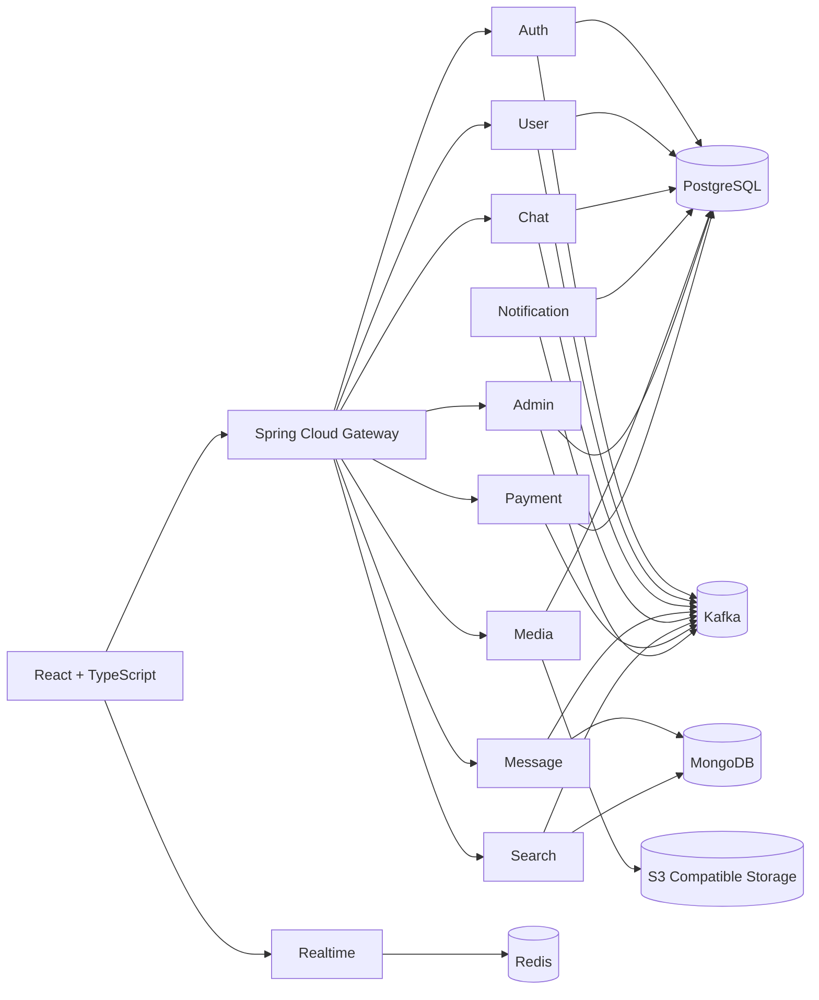
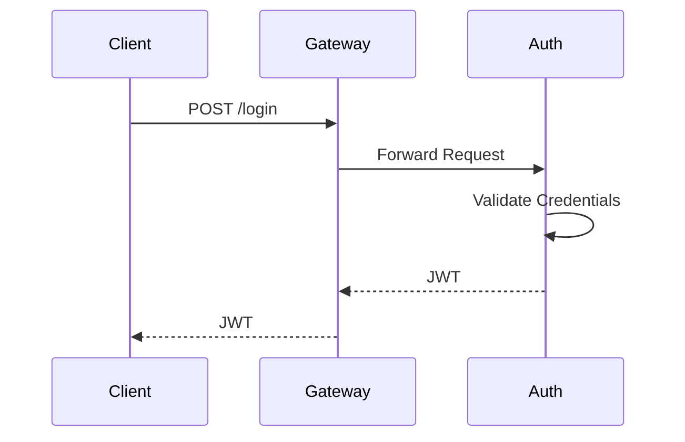
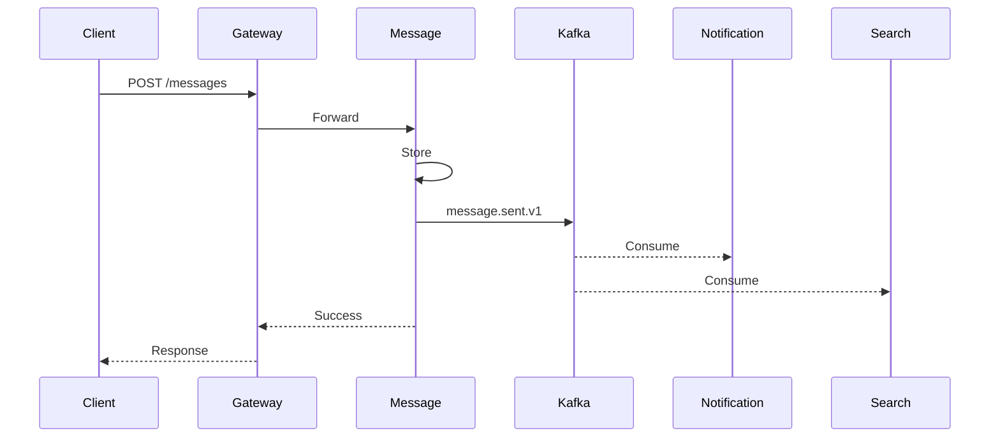
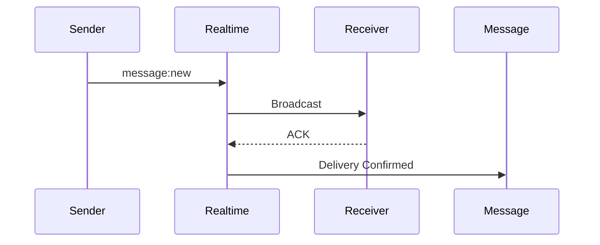
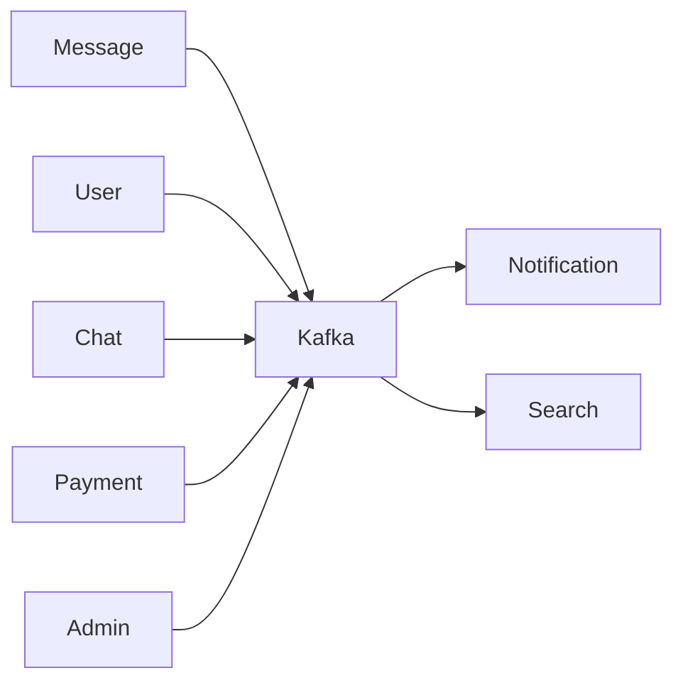
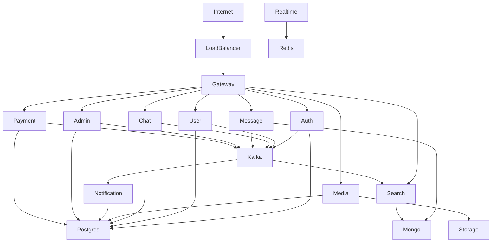

# 01_System_Architecture.md

> Version: 1.0
> Last Updated: July 2026
> Status: FINAL
> Audience: Solution Architects, Backend Engineers, Frontend Engineers, DevOps Engineers, QA Engineers, AI Coding Agents

---

# 1. Purpose

This document describes the overall architecture of the Chat Platform.

It explains:

- System boundaries
- Service responsibilities
- Communication patterns
- Infrastructure
- Data flow
- Deployment topology
- Technology choices
- Scalability strategy

This document serves as the primary architectural reference for implementation.

---

# 2. High-Level Overview

The Chat Platform is designed as a **cloud-native, event-driven microservices architecture**.

The system is composed of independently deployable services communicating through:

- REST APIs (Synchronous)
- Apache Kafka (Asynchronous)
- Socket.IO (Real-Time Communication)

Each service owns exactly one business domain and one database.

No service directly accesses another service's database.

---

# 3. Architectural Principles

The platform is built around the following principles:

- Single Responsibility Principle
- Domain-Driven Design (DDD)
- Database Per Service
- Loose Coupling
- High Cohesion
- API-First Design
- Event-Driven Communication
- Horizontal Scalability
- Fault Isolation
- Stateless Services

---

# 4. System Context Diagram



---

# 5. Service Landscape

| Service | Primary Responsibility |
|------------|--------------------------|
| Auth Service | Authentication & JWT |
| User Service | User Profiles, Friendships, Preferences |
| Chat Service | Conversations & Group Metadata |
| Message Service | Messages & Conversations |
| Realtime Service | Socket.IO Communication |
| Notification Service | User Notifications |
| Media Service | File Management |
| Search Service | Search Index |
| Admin Service | Platform Administration |
| Payment Service | Subscription & Payments |

---

# 6. Service Responsibilities

## Auth Service

Owns:

- Login
- Registration
- JWT
- Refresh Tokens

Does NOT own:

- User Profile
- Friendships

---

## User Service

Owns:

- Profiles
- Friendships
- Preferences

---

## Chat Service

Owns:

- Direct Chats
- Groups
- Membership
- Chat Settings

---

## Message Service

Owns:

- Messages
- Replies
- Polls
- Reactions
- Read Receipts

---

## Realtime Service

Owns:

- Socket.IO
- Presence
- Heartbeats
- Room Management

Redis only.

---

## Notification Service

Owns:

- Notification History
- Templates
- Deduplication

Consumes Kafka.

---

## Media Service

Owns:

- Upload
- Metadata
- Object Storage

Stores metadata only.

Files live in S3-compatible storage.

---

## Search Service

Owns:

Search Indexes.

Never owns original business data.

Consumes Kafka.

---

## Admin Service

Owns:

- Moderation
- Audit Logs
- Platform Administration

No direct database manipulation of other services.

---

## Payment Service

Owns:

- Subscriptions
- Payments
- Payment History

Webhook is source of truth.

---

# 7. Communication Architecture

The platform supports three communication mechanisms.

## 7.1 REST

Used when immediate response is required.

Examples:

- Login
- Fetch Profile
- Create Chat
- Upload Metadata

---

## 7.2 Kafka

Used for asynchronous communication.

Examples:

- Notifications
- Search Index
- Analytics
- Event Propagation

Kafka guarantees loose coupling.

---

## 7.3 Socket.IO

Used only for:

- Live Messaging
- Typing Indicators
- Presence
- Delivery Updates

Socket.IO never owns business data.

---

# 8. Request Flow

## Login



---

## Send Message



---

## Real-Time Delivery



---

# 9. Event Flow



---

# 10. Database Architecture

| Database | Services |
|------------|----------------|
| PostgreSQL | Auth, User, Chat, Notification, Media, Admin, Payment |
| MongoDB | Message, Search |
| Redis | Realtime |

Each database belongs exclusively to one service.

---

# 11. Object Storage

Media files are NOT stored inside PostgreSQL.

Architecture:

```text
React

↓

Media Service

↓

Generate Pre-Signed URL

↓

Client uploads directly

↓

S3 Compatible Storage

↓

Media Metadata stored in PostgreSQL
```

Only Media Service knows:

- Bucket
- Object Key
- Storage Path

Other services receive only:

mediaId

---

# 12. Search Architecture

Search Service owns only indexes.

Flow:

```text
Message Created

↓

Kafka

↓

Search Service

↓

MongoDB Text Index

↓

Search API
```

Original data always remains inside the owner service.

---

# 13. Presence Architecture

Realtime Service owns presence.

Redis stores:

- Online Status
- Last Heartbeat
- Device Count

Presence is never stored in PostgreSQL.

---

# 14. Notification Architecture

Notifications are generated from Kafka events.

Flow:

```text
Message Sent

↓

Kafka

↓

Notification Service

↓

Notification Created

↓

Stored

↓

Displayed
```

User preferences remain inside User Service.

Notification Service consults User Service when required.

---

# 15. Security Architecture

Authentication:

JWT

Authorization:

Service-Level

Gateway authenticates requests.

Every downstream service authorizes them independently.

---

# 16. Scalability Model

Each service scales independently.

Examples:

Heavy messaging:

Scale Message Service only.

Heavy uploads:

Scale Media Service only.

Heavy searches:

Scale Search Service only.

Heavy Socket connections:

Scale Realtime Service only.

---

# 17. Failure Isolation

The platform is designed to tolerate partial failures.

Examples:

Message Service unavailable:

- Login continues.
- Search continues.
- User Profile continues.

Notification unavailable:

- Messaging continues.
- Notifications delayed.

Search unavailable:

- Messaging continues.
- Search temporarily unavailable.

Each service fails independently.

---

# 18. Deployment View



---

# 19. Service Dependency Matrix

| Service | Depends On |
|------------|----------------|
| Gateway | All Backend Services |
| Auth | PostgreSQL |
| User | PostgreSQL, Kafka |
| Chat | PostgreSQL, Kafka |
| Message | MongoDB, Kafka |
| Realtime | Redis |
| Notification | PostgreSQL, Kafka |
| Media | PostgreSQL, Object Storage |
| Search | MongoDB, Kafka |
| Admin | PostgreSQL, Kafka |
| Payment | PostgreSQL, Kafka |

No service depends directly on another service's database.

---

# 20. Architectural Decisions

### Accepted

- Database Per Service
- Kafka Event Bus
- JWT Authentication
- UUIDv7
- MongoDB for Messages
- PostgreSQL for Relational Data
- Redis for Presence
- Spring Cloud Gateway
- S3-Compatible Storage
- MongoDB Text Search
- Socket.IO
- Single Search Endpoint
- Message Sequence Numbers
- Soft Deletes
- Webhook-Based Payment Verification
- Notification Deduplication
- Template-Based Notifications

### Deferred

- Elasticsearch/OpenSearch
- Virus Scanning
- Prometheus & Grafana
- Analytics Service
- Media Thumbnails
- Video Transcoding
- Multi-Region Deployment

---

# 21. Summary

The Chat Platform architecture follows modern cloud-native design principles by combining:

- Microservices
- Event-Driven Communication
- Independent Databases
- Real-Time Messaging
- Object Storage
- Search Indexing
- Stateless Services
- Horizontal Scalability

Every service owns exactly one business domain.

No ownership overlaps exist.

The architecture is designed to support future growth while maintaining clean service boundaries.

---

**Status:** FINAL

**Version:** 1.0

**Next Document:** 02_API_Contracts.md